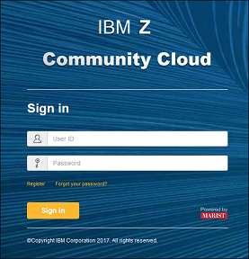
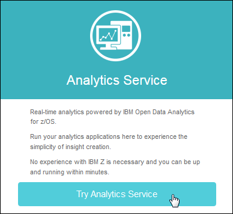
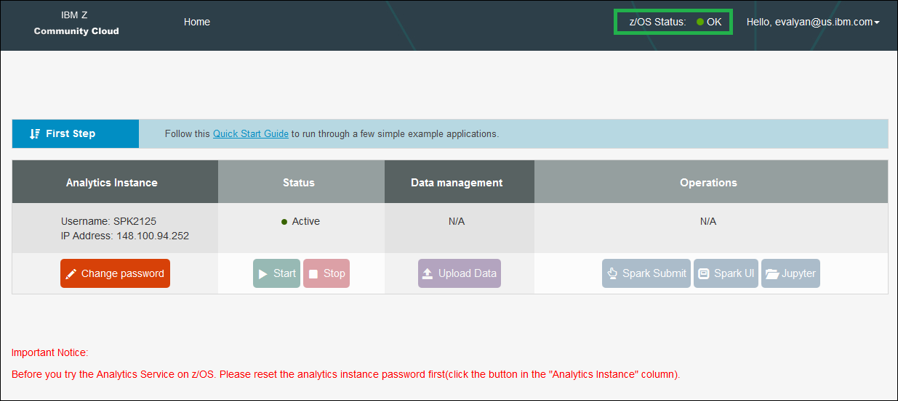
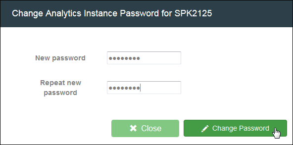
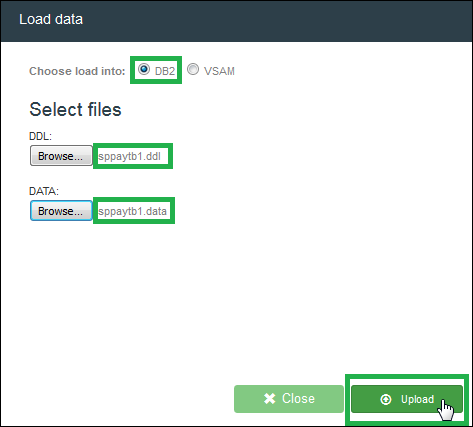
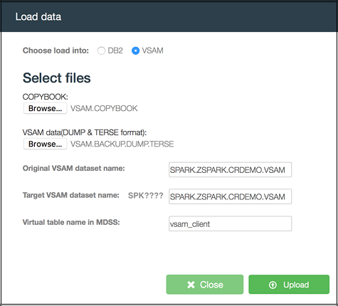
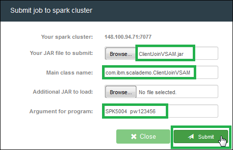

# **** Work in Progress ****
# Running Analytics on z/OS

## Overview

The following instructions can be used to demonstrate running analytics applications using IBM Open Data Analytics for z/OS. This analytics examples use data stored in DB2 and VSAM tables, and machine learning algorithms written in Scala and Python. You will use fictitious customer information and credit card transaction data to evaluate customer retention.

## Architecture
To be added

## Steps

1. Sign up for an IBM Z Community Cloud account.
2. Log in to the Self Service Portal.
3. Configure your Analytics Instance and upload data.
4. Use case #1: Run a Scala program in batch mode.
5. Use case #2: Run a Python program with Jupyter Notebook.

## Step 1. Sign up for an IBM Z Community Cloud account

1. If you have not done so already, go to [IBM z Systems Trial Program](http://www-03.ibm.com/systems/z/resources/trials.html) and register for a 30-day trial account. 
2. Select the **Analytics Service on z/OS** trial. 
3. Fill out and submit the registration form.
4. You will receive an email containing credentials to access the self-service portal. This is where you can start exploring all our available services.

## Step 2. Log in to the Self Service Portal

Note: The Mozilla Firefox browser is recommended for these examples.

1. Open a web browser and access the [IBM Z Community Cloud self-service portal](https://zcloud.marist.edu/#/login). 
   
   

    1. Enter your Portal User ID and Portal Password
    2. Click **'Sign In'**
       You will see the home page for the IBM Z Community Cloud self-service portal.  
       
2. Select the **Analytics Service**.

    1. Click **'Try Analytics Service'**
    
   
 
3. You will now see a dashboard, which shows the status of your Analytics instance. 

   
   
   + At the top of the screen, notice the **'z/OS Status'** indicator, which should show the status of your instance as **'OK'**.     
   + In the middle of the screen, the **‘Analytics Instance’**, **‘Status’**, **‘Data management’**, and **‘Operations’** sections will be displayed. The **‘Analytics Instance’** section contains your individual Analytics Instance Username and IP address.
   + Below the field headings, you will see buttons for functions that can be applied to your instance. 
 
  The following table lists the operation for each function:

  | Function        | Operation                                                  | 
  | --------------- | ---------------------------------------------------------- | 
  | Change Password | Click to change your Analytics Instance password           |
  | Start           | Click to start your individual Spark cluster               |        
  | Stop            | Click to stop your individual Spark cluster                | 
  | Upload Data     | Click to select and load your DDL and data file into DB2   | 
  | Spark Submit    | Click to select and run your Spark program                 | 
  | Spark UI        | Click to launch your individual Spark worker output GUI    | 
  | Jupyter         | Click to launch your individual Jupyter Notebook GUI       | 

## Step 3. Configure your Analytics Instance and upload data

1. For logging in the first time, you must set a new Analytics Instance password.
   
   
   
    1. Click **‘Change Password’** in the **‘Analytics Instance’** section
    2. Enter a **new password** for your Analytics Instance
    3. Repeat the **new password** for your Analytics Instance
    4. Click **‘Change Password’**
 
   
   
2. Confirm your instance is Active. 

    1. If it is **‘Stopped’**, click **‘Start’** to start it
   
   
 
3. (Optional) The DB2 data for this exercise has already been loaded for you, no further action is required. The DDL and DB2 data file are provided in the [zAnalytics Github repository] for your reference.  

   + DB2 data file: sppaytb1.data
   + DB2 DDL: sppaytb1.ddl
   
   Follow these steps if you wish to upload your own DB2 data.    
    1. Click **‘Upload Data’**        
    
    
    
    2. Select the DB2 DDL file
    3. Select the DB2 data file
    4. Click **‘Upload’**
    
       
 
   You will see the status change from **‘Transferring’** to **‘Loading’** to **‘Upload Success’**.  

4. (Optional) The VSAM data for this exercise has already been loaded for you, no further action is required. The VSAM copybook and VSAM data file are provided in the [zAnalytics Github repository] for your reference.  

   + VSAM data file: VSAM.BACKUP.DUMP.TERSE
   + VSAM copybook: VSAM.COPYBOOK
   
   Follow these steps if you wish to upload your own VSAM data. 
    1. Click **‘Upload Data’**
    2. Select the VSAM copybook
    3. Select the VSAM data file
    4. Enter your original (existing) VSAM data file name
    5. Enter a target (new) VSAM data file name
    6. Enter a virtual table name for your target VSAM data file 
    7. Click **‘Upload’**
   
       
 
## Step 4. Use case #1: Run a Scala program in batch mode

The sample Scala program will access DB2 and VSAM data, perform transformations on the data, join these two tables in a Spark dataframe, and store the result back to DB2.

1. Download the prepared Scala program from the [zAnalytics Github repository] to your local workstation.

    1. Click the **ClientJoinVSAM.jar** file.
    2. Click **Download**.
    
    

2. Submit the downloaded Scala program to analyze the data. 
    
    1. Click **‘Spark Submit’** 
    
       
       
    2. Select the **‘ClientJoinVSAM.jar’** file you just downloaded
    3. Specify Main class name **‘com.ibm.scalademo.ClientJoinVSAM’**
    4. Enter the arguments: <**Your 'Analytics Instance Username'**> <**Your 'Analytics Instance Password'**>
    5. Click **‘Submit’**
    
       
 
   **“JOB Submitted”** will appear in the dashboard when the program is complete. 

3. Launch your individual Spark worker output GUI to view the job you just submitted.
    
    1. Click **‘Spark UI’**
    
       
       
    2. Authenticate with your **'Analytics Instance Username'** and **'Analytics Instance Password'**
    
       
       
    3. Click the **‘Worker ID’** for your program in the **‘Completed Drivers’** section
    
       
       
    4. Authenticate with your **'Analytics Instance Username'** and **'Analytics Instance Password'**
    
    5. Click on **‘stdout’** for your program in the **‘Finished Drivers’** section to view your results
    
       
 
   Your results will show:
   
   + The top 20 rows of the VSAM data (customer information) in the first table,
   + The top 20 rows of the DB2 data (transaction data) in the second table, and
   + The top 20 rows of the result ‘client_join’ table in the third table.
   
## Step 5. Working with Jupyter Notebook – Python example
In this section, you will use the Jupyter Notebook tool that is installed in the dashboard. This tool allows you to write and submit Python code, and view the output within a web GUI.

The prepared Python program will access DB2 and VSAM data using the dsdbc driver, perform transformations on the data, join these two tables in a pandas dataframe using python APIs and create plots using matplotlib. It will also perform a random forrest regression analysis and plot several charts.

1. Download the prepared Python example from the [zAnalytics Github repository] to your local workstation.

    1. Click the **Python3_Demo.ipynb** file
    
    
    
    2. Click **'Raw'**
    
    
    
    3. From your browser's 'File' menu, select 'Save Page As...'

2. Launch the Jupyter Notebook service from your dashboard in your browser.
    1. Click **‘Jupyter’**
 
       
 
       You will see the Jupyter Notebook home page.

3. Upload the Jupyter Notebook from your local workstation.    
    1. Click **'Upload'**
       
    2. Select the file Python3_Demo.ipynb from your local workstation
    3. Click **'Open'**

4. Click **'Upload'**

       

4. Double click **'Python3_Demo.ipynb'**
 
The Jupyter Notebook will connect to your Spark on z/OS instance automatically and will be in the ready state when the Python 3 indicator in the top right-hand corner of the screen is clear.
 
3.	The Jupyter Notebook environment is divided into input cells labeled with **‘In [#]:’**.  
Run cell #1 - The Python code in the first cell assigns variables and imports packages used in the example.
	Click on the first **‘In [ ]:’**
The left border will change to blue when a cell is in command mode.
	Click in the cell to edit
The left border will change to green when a cell is in edit mode.
	Change the value of USERNAME to your **‘Analytics Instance Username’**
	Change the value of PASSWORD to your **‘Analytics Instance Password’**
	Change the value of MDSS_SSID to **‘AZK1’**
	Change the value of DB2_SSID to **‘DBBG’**
 
Execute the Python code in the first cell. Jupyter Notebook will check the Python code for syntax errors and run the code for you.
	Click the run cell button as shown below:
 
The Jupyter Notebook connection to your Spark instance is in the busy state when the Python 3 indicator in the top right-hand corner of the screen is grey. 
 
4.	When this indicator turns clear, the cell run has completed and returned to the ready state.
5.	Continue to click and run the remaining **‘In [ ]:’**.

[zAnalytics Github repository]: https://github.com/ibmz-community-cloud/zAnalytics
